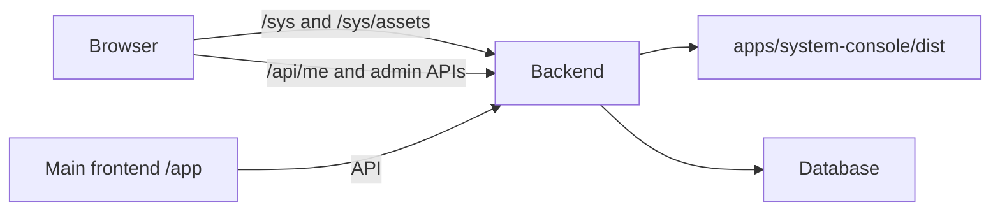

# Standalone System Console

The superuser console is a separately built React application at `/sys`. Express serves its static build on the backend port even with `API_ONLY=true` or `NODE_ENV=production`. No workspace frontend process, Vite middleware, or frontend nginx container is required to open it.



## Source and runtime boundaries

- `apps/system-console`: console entry, login/setup screen, shell and its own Vite build with `/sys/` asset paths.
- `packages/platform-console`: existing admin views, approved frontend header/sidebar, shared identity/navigation/permission contexts, translations and styles. Existing frontend module paths re-export this package to preserve callers. Both applications use the same implementations.
- `apps/frontend`: organization workspace and onboarding; platform navigation transfers to `/sys`.
- `apps/backend/src/systemConsoleHosting.ts`: serves only the console directory. Missing resources return 404; a missing console build returns 503 with the required build command. It never exposes backend source or mutable data.
- `packages/shared/src/systemConsole.ts`: exact canonical system tab IDs shared by both applications and legacy-link handling.

The console entry does not import the workspace App, document editor or operational views. Platform permissions come from `/api/me`; console access does not require an active organization or membership. Catalog forms load `/api/policy-packs` independently of organization policy.

## Commands

```sh
npm ci
npm run dev:backend
```

This builds the console, then starts the backend alone on port 3000. Open `http://127.0.0.1:3000/sys?tab=admin-system-dashboard`.

`npm run dev` builds the console and starts the combined development backend/workspace. To continuously rebuild console changes while either backend mode runs, use `npm run dev:sys` in another terminal; it watches builds and does not start another HTTP server. Refresh `/sys` after a rebuild.

Production/manual deployment:

```sh
npm run build:sys
npm run build:backend
NODE_ENV=production npm start
```

Copy both `apps/backend/dist` and `apps/system-console/dist` into the release. The backend Dockerfile builds and carries both, without building the main frontend. An optional absolute `SYSTEM_CONSOLE_DIR` selects another console build location.

Docker Compose exposes the backend on host loopback `127.0.0.1:3000`, so stopping its frontend container does not remove direct console access. The main frontend nginx and Vite proxy `/sys` to the backend, so links work from the workspace's origin too. Direct access to backend `/sys` remains available when that frontend service is stopped.

## Routing and authentication

The console reuses the workspace header, collapsible sidebar and grouped System Admin navigation. Its branding-only `TenantProvider` mode loads platform presentation branding without fetching organizations, selecting one or loading tenant capabilities. The existing admin content stays unchanged.

- `/sys` defaults to `admin-system-dashboard`; exact supported `?tab=admin-system-*` IDs support refresh, bookmarks and browser history. Unsupported console tab IDs return to its dashboard.
- Canonical legacy `/app?tab=admin-system-*` requests redirect to `/sys`. Client navigation also transfers to `/sys`; existing workspace alias resolution remains in place.
- The console reuses existing password and Google authentication, session handling and `/api/me`. Its login does not offer self-registration; a fresh installation supports the existing atomic first-superuser setup endpoint.
- Ordinary users are denied before admin views mount. Existing server permissions independently protect every admin API.
- New accounts still require manual superuser approval. Email verification is not required.
- `Manage organization` validates access, saves the identity-bound selection in a new tab, then opens `/app?tab=settings-organization`. Organization operations require the main frontend to be available.

## Verification and limits

`npm run test:system-console` checks hosting, missing resources, build availability and legacy redirects. `npm run test:e2e:sys` builds the real console and tests it against an isolated API-only backend, without starting any workspace frontend server. All fixtures use a temporary database.

Browser coverage includes real login/logout, account denial, first-superuser setup, manual approval, all system tabs, history, language/theme, mobile navigation and organization handoff. Existing build isolation tests cover all three output directories and shared package cache invalidation.

The console remains dependent on the backend and database. Stopping the backend also stops `/sys`. API contracts and the database schema remain shared; no database migration is introduced by this separation. Rollback requires restoring the matching code and build artifacts, with no data rollback.
